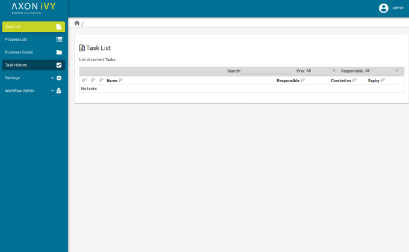

The Basic Workflow UI is a smart worklow user interface with a minimal set of features to perform all necessary workflow activities.

### Import

You can use the import wizard in Axon.ivy Designer

`File > Import > Axon.ivy > Ivy Projects`

