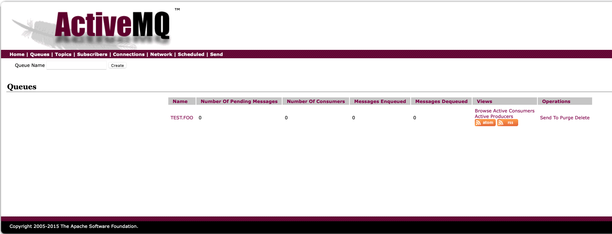
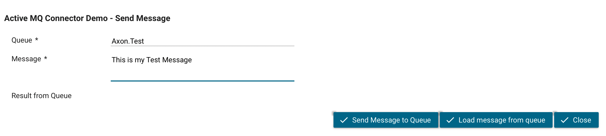
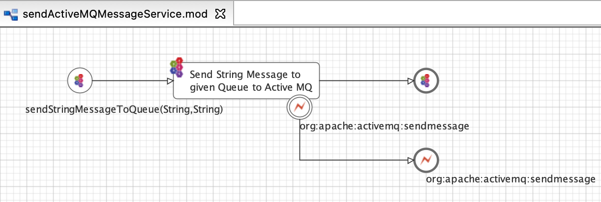
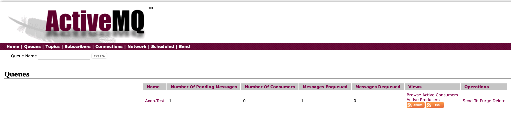
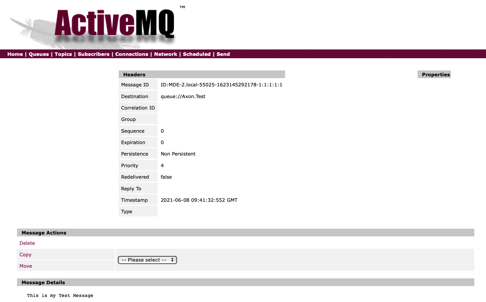
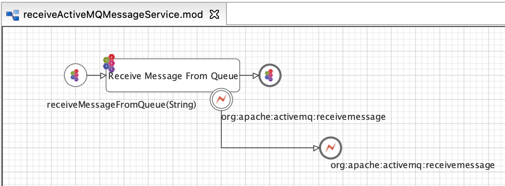

# Active MQ Connector

Axon Ivy’s [Active MQ Connector Services](https://activemq.apache.org) connector helps you to send and receive messages with Apache ActiveMQ®, which is a open source, multi-protocol, Java-based message broker. It supports industry standard protocols so users get the benefits of client choices across a broad range of languages and platforms

This connector:

- Use Active MQ Java Services in order to communicate with Active MQ.
- Provide ready to use service processes to send and receive simple messages by using Queues

## Active MQ Setup

Use the docker image https://hub.docker.com/r/benyoo/activemq to setup a simple Active MQ Server. Get the image with docker pull benyoo/activemq

Run the image with docker run -p 61616:61616 -p 8161:8161 benyoo/activemq

After you run the Docker image you can access the Active MQ Broker Administrator: http://localhost:8161/admin/index.jsp. You can browse through Queues, Topics, etc. 

## Demo

Shows how to send and receive simple String messages to a given Queue. Use the Start Process "Active MQ Message Queue Demo" to start the Demo UI to send and receive String messages to a given Queue.

The connect service processes need a global variable that provide the Broker URL of Active MQ. In the current version you need to create a global variable manually in your project:

activemq_broker_url: 'tcp://localhost:61616'

The Port must match with the provided port in your docker image.

## Send Messages to Active MQ

If you want to send messages to a Queue you can use the subprocess sendActiveMQMessageService. Simple provide your message and Queue to the subprocess. In our demo you can use the provided UI. Define a Queue and a message and click on Send Message to Queue.

After you sent you message you can check the Queue by using the Active MQ Administrator

If you click on a single message you see all details of the message

## Receive Messages to Active MQ

If you want to receive messages from a Queue you can use the subprocess receiveActiveMQMessageService. Simple provide a Queue to the subprocess from which the service should read the message. In our demo you can use the provided UI. Define a Queue and click on Receive Message from Queue.

