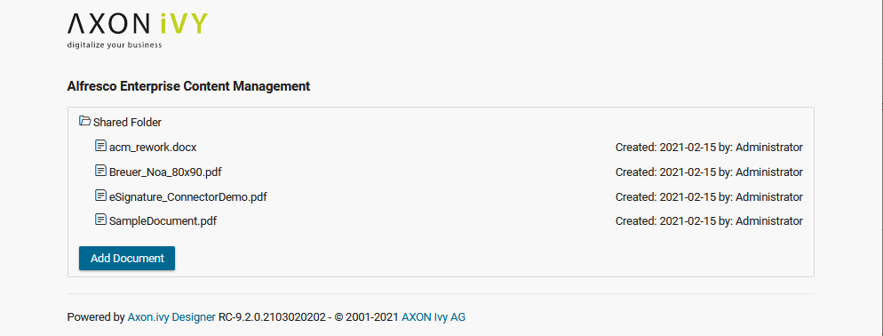
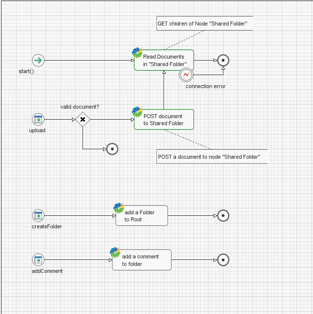
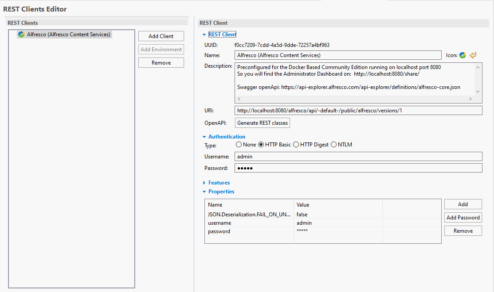

Axon Ivy’s [Alfresco Content Services](https://www.alfresco.com/de/ecm-software) connector helps you to accelerate process automation initiatives by accessing content wherever and however you work. Alfresco Content Services includes full-featured enterprise content management system (ECM) capabilities. This connector:

- Is based on REST webservice technologies.
- Provides access to the core features of Alfresco Content Services. e.g. create folders and to post documents.
- Supports you with an easy-to-copy demo implementation to reduce your integration effort.
- Enables low code citizen developers to integrate existing 3rd party systems. 

## Demo

Shows how to create folders and post documents.

## Setup

The connector is preconfigured for the Community Edition for Docker running on localhost port 8080. See: https://www.alfresco.com/de/thank-you/thank-you-downloading-alfresco-community-edition

You may adjust the alfresco Rest client to access your alfresco installation.

