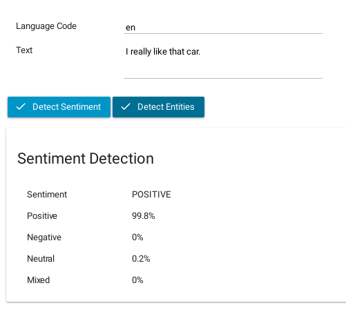
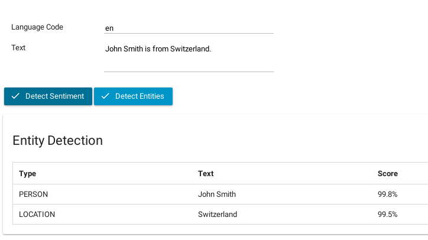
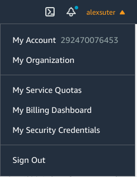
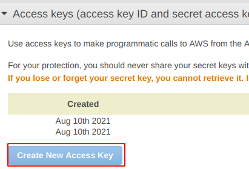

Axon Ivy's Amazon Comprehend Connector.

## Demo

### Sentiment Detection

1. Type any text you like into the text field like: _I really like that car_.
2. Click on Detect Sentiment
3. Amazon Comprehend will detect the sentiment for you.



### Entities Detection

1. Type any text you like into the text field like: _John Smith is from Switzerland_.
2. Click on Detect Entities
3. Amazon Comprehend will detect the entities for you.




## Setup

1. First you need to create a secret key and an access key for Amazon.
   Go to https://aws.amazon.com

2. Login or create a new account.

3. Click on My Security credentials:



4. Create a new access key and a new secret key.



5. Configure the following variables in your project:

```
Variables:

  Amazon.Comprehend:

    # Secret key to access amazon comprehend     
    SecretKey: <YOUR_SECRET_KEY>
    
    # Access key to access amazon comprehend
    AccessKey: <YOUR_ACCESS_KEY>
```
