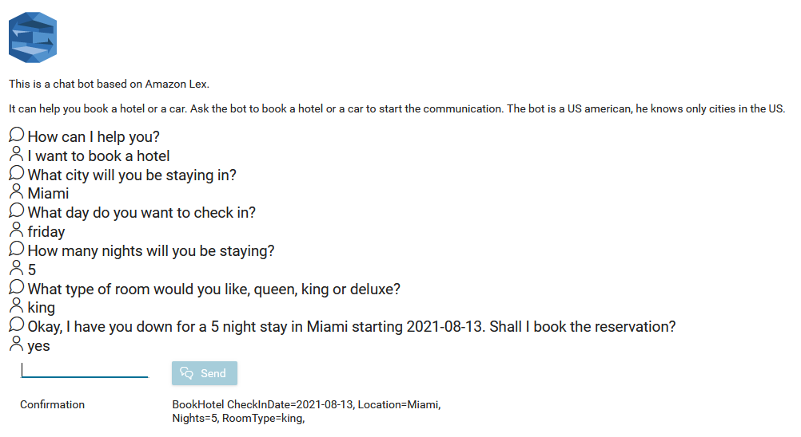
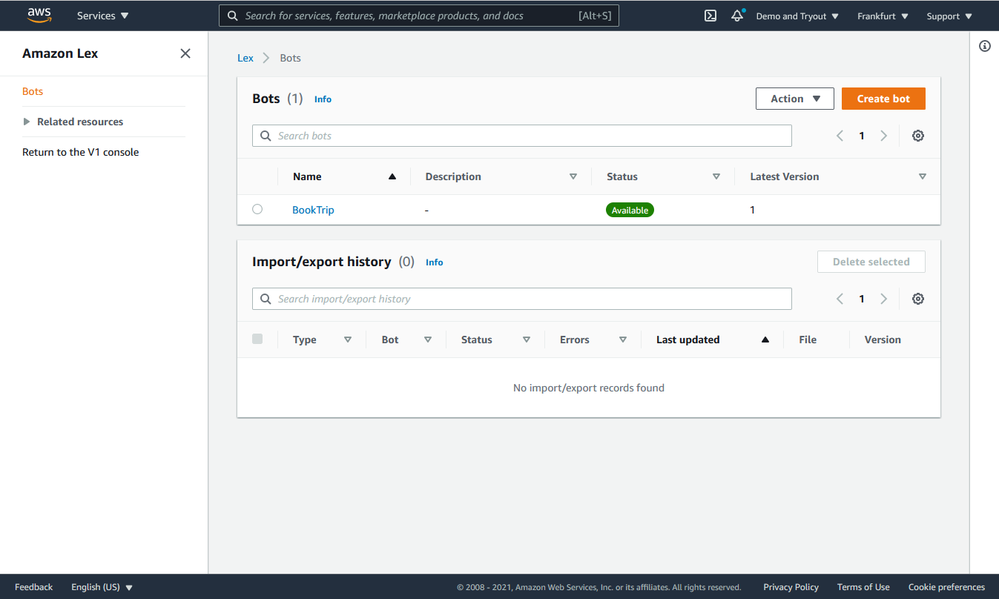

Axon Ivy’s [Amazon Lex API](https://aws.amazon.com/lex/) helps you to accelerate process automation
initiatives by introducing Natural Language Processing (NLP) and Machine
Learning (ML) to your process work. Amazon Lex builds sophisticated, natural language, conversional bots (chatbots). This connector:

- Is based on a freemium pricing model by AWS.
- Provides APIs to send user message to bots and vice versa.
- Identifies user itent and additional information collected by the bot.
- Supports you with an easy-to-copy demo implementation to reduce your
  integration effort.

## Demo

### Chat Bot

The chat bot demo is based on the amazon BookTrip demo bot. 
1. Type a booking text you like into the text field like: _I want to book a hotel_ or _I want to book a car_.
2. Answer the questions of the bots
3. Amazon Lex will detect your intent and provides additional information in the confirmation.



## Setup

1. First you need to create a Amazon Lex bot.
   Go to https://aws.amazon.com

2. Login or create a new account.

3. Click on Services / Amazon Lex.

4. Click on Getting Started Guide and follow the instruction to create a new bot. 
  Ensure that you create a V2 bot
  Use template BookTrip
  
  

5. Configure the following variables in your project:

```
Variables:

  Amazon.Lex:

    # Secret key to access amazon lex
    # [password] 
    SecretKey: <YOUR_SECRET_KEY>
    
    # Access key to access amazon lex
    # [password]
    AccessKey: <YOUR_ACCESS_KEY>
    
    # Identifier of the amazon lex bot alias that should be called
    BotAliasId: <YOUR_BOT_ALIAS_ID>
    
    # Identifier of the amazon lex bot that should be called
    BotId: <YOUR_BOT_ID>
```
