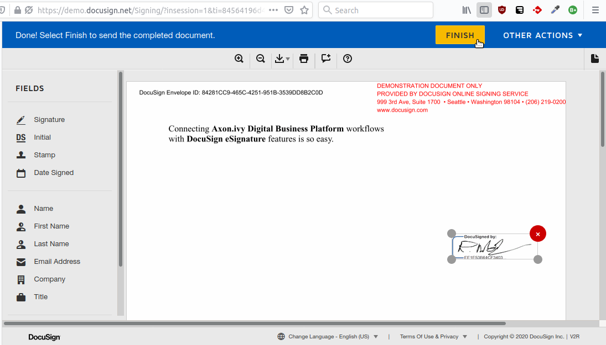
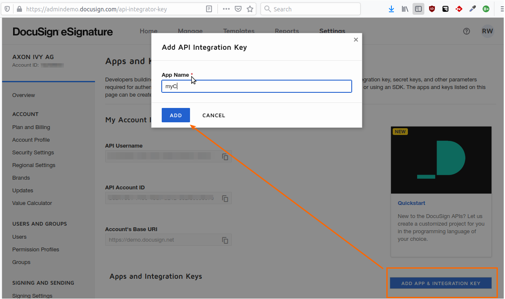
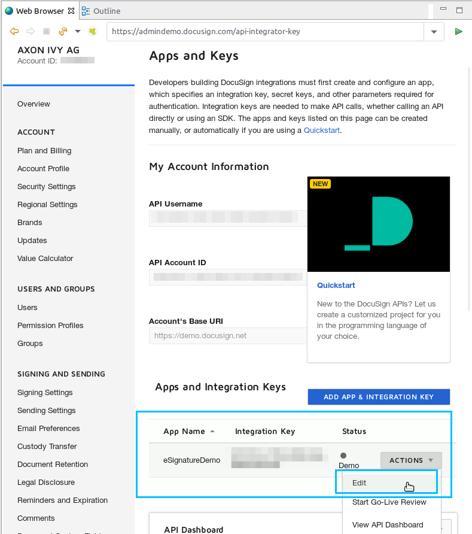
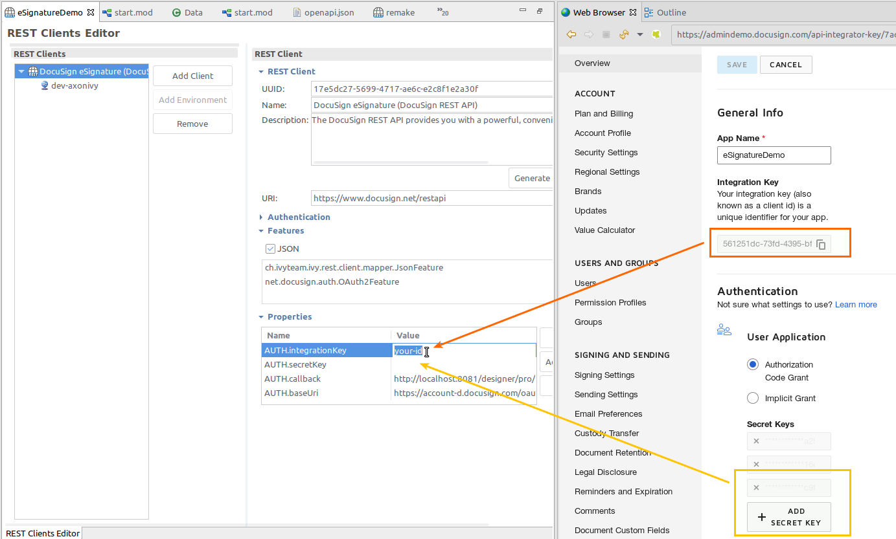
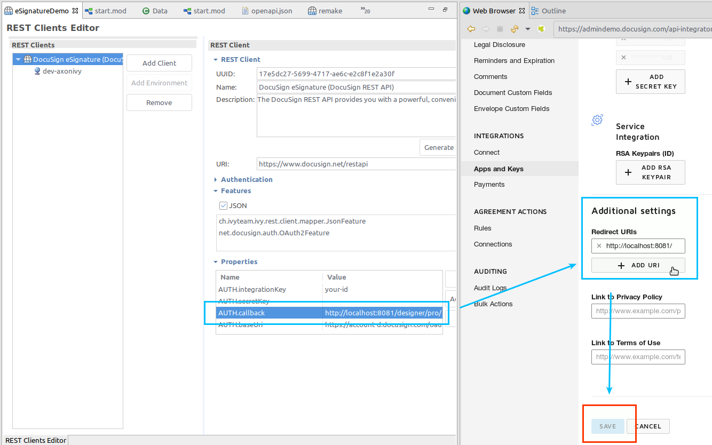

Integrate eSignatures into your application in minutes. DocuSign's secure and award-winning eSignature makes requesting signatures, automating forms, and tracking documents directly from your app easy.

## Demo

1. Upload a document and assign **signers** for it.

1. Signers will be involved by an e-mail into the web-based signing flow.

## Setup

Before any signing interactions between the Axon.ivy Engine and the DocuSign eSignature services can be run, they have to be introducted to each other. This can be done as follows:

1. Create a free DocuSign developer account: https://account-d.docusign.com/#/username
1. Create a new `application`: https://admindemo.docusign.com/authenticate?goTo=apiIntegratorKey

1. Edit the created application:

1. Open the `Definitions/Rest Clients` Editor in your Designer and select `DocuSign eSignature` client.

1. Copy the **Integration Key** from the docusign admin frontend into the Rest Clients property section value of `AUTH.integrationKey`

1. Scroll to **Authentication** choose `Authorization Code Grant`.
1. Click `Add Secrect Key` and copy the generated key into the Rest Clients property value called `AUTH.secretKey`

1. Scroll to the **Additional settings** section in the docusing admin frontend:
	1. Adjust the Rest Client Property `AUTH.callback` : replace 'eSignatureDemo' in the URI with the name of your project where the connector has been installed to. E.g.
...localhost:8081/designer/pro/~~eSignatureDemo~~/17651A0FB6AFB366/authenticated.ivp
...localhost:8081/designer/pro/++myCoolProject++/17651A0FB6AFB366/authenticated.ivp

	2. Copy the updated `AUTH.callback` URI also into the docusign admin frontend under `Redirect URIs`.

1. Save the changed application settings.

1. run 'start.ivp' of the eSign demo process to test your setup.
You will need to login with your docuSign account as a first step.

