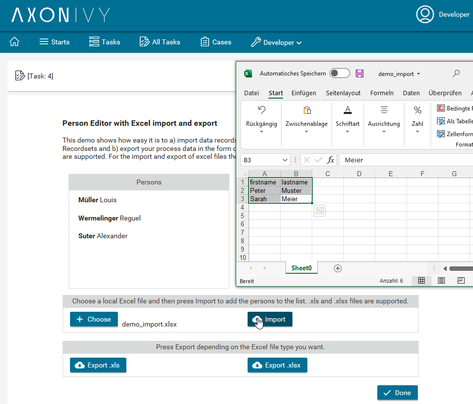
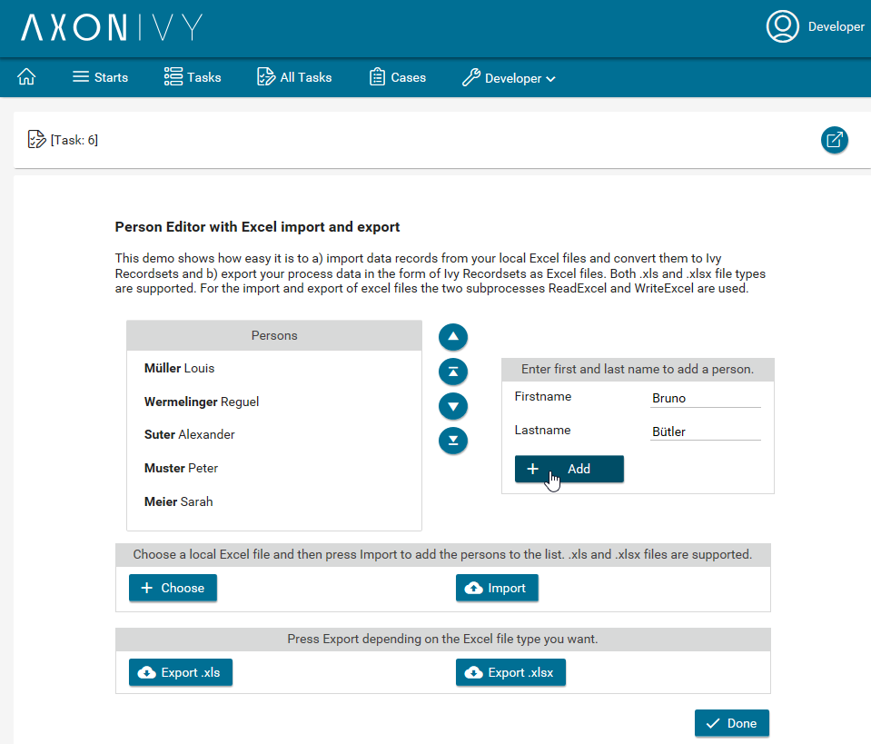
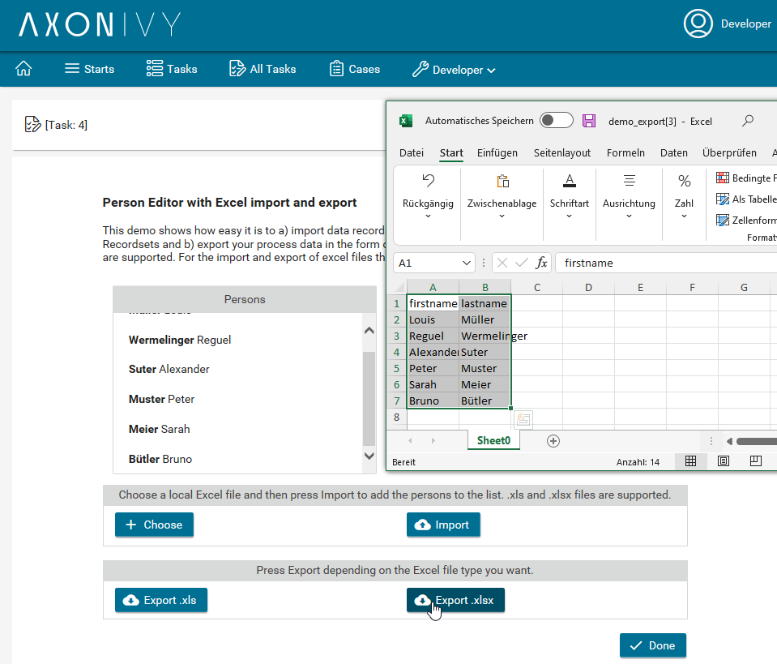

# Excel Connector
Axon Ivy's **Microsoft Excel** connector helps you accelerate process automation initiatives by reading and writing MS Excel files in your business process. This connector:

- Allows you to import a local MS Excel file and convert it into any Ivy Recordset
- Enables the export of Ivy Recordsets to an MS Excel file
- Supports you with an easy-to-copy demo implementation to reduce your integration effort.

## Demo

