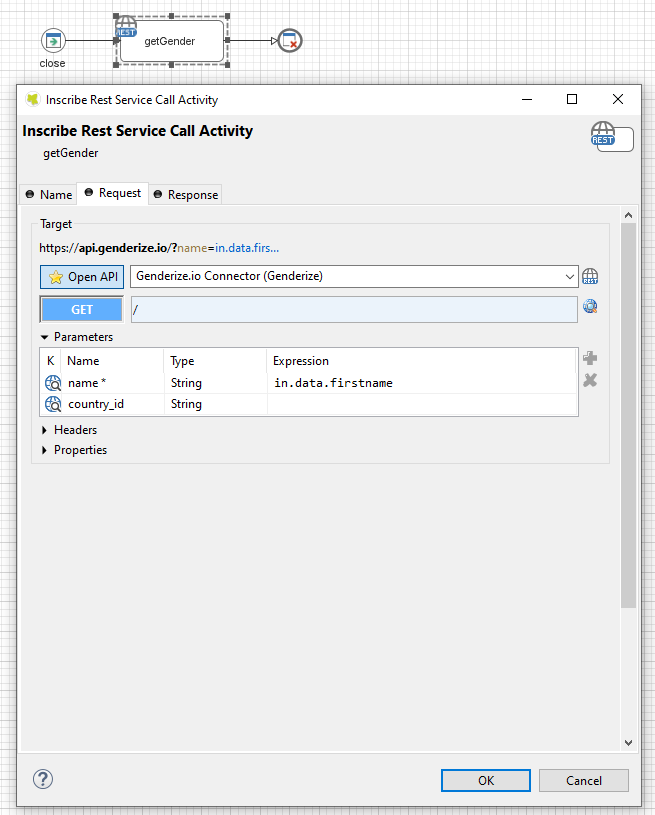
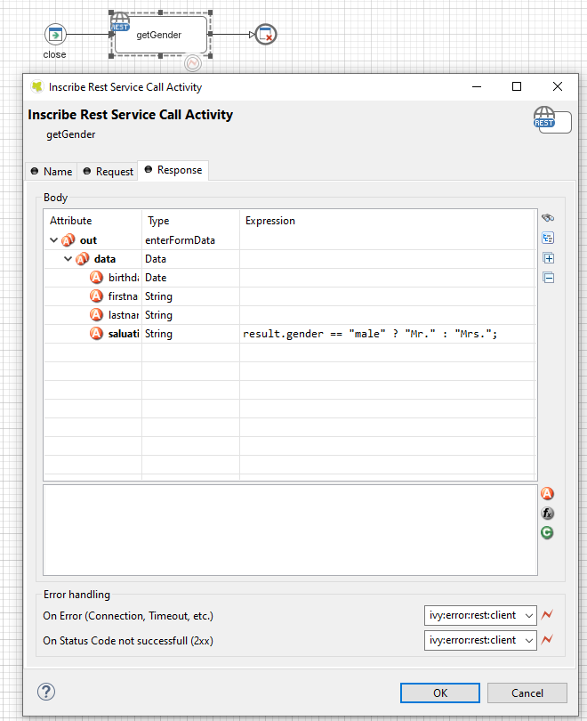
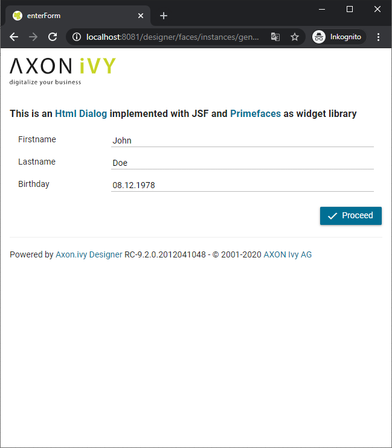

Axon Ivy’s [genderize.io](https://genderize.io) connector helps you to accelerate process automation initiatives by predicting the gender of a person given their name. The connector gives you access to a powerful API which is for free up to 1000 names/day. This connector:

- Provides a powerful solution to implement modern UI patterns.
- Supports three different usages. A simple one-name determination, a batch usage for up to 10 names at a time and a classification of genders in the scope of a specific country.
- Enables you to easily enhance missing properties in any process data to guarantee a successful backend data synchronization.

## Demo

With this connector a demo process will be installed to demonstrate a simple use case that determines the gender of a person and automatically adds the salutation property to the process data.

API call

Result mapping

Example: Input Form

Example: Result Form

