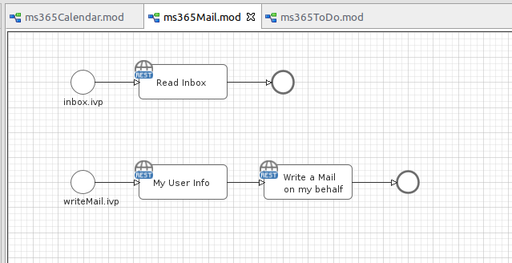
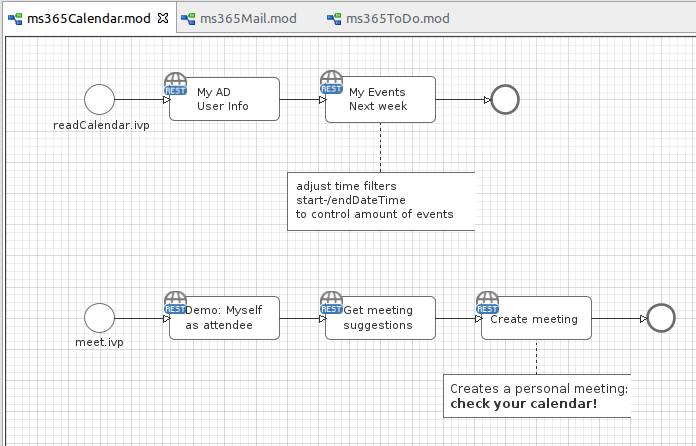
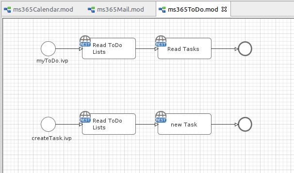
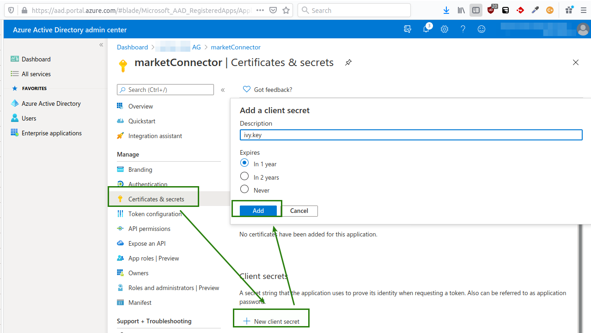
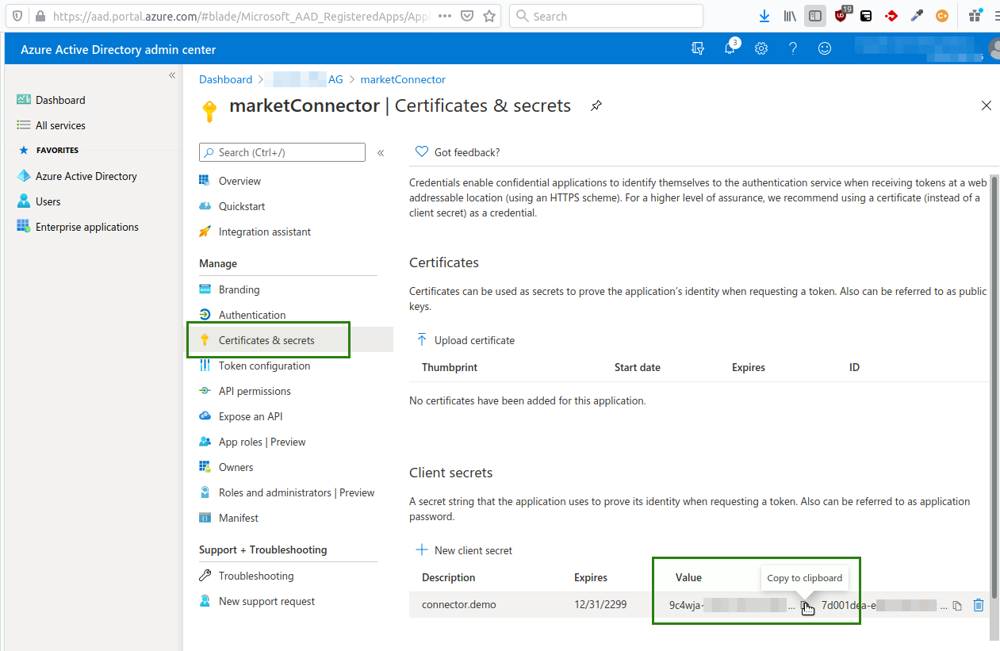
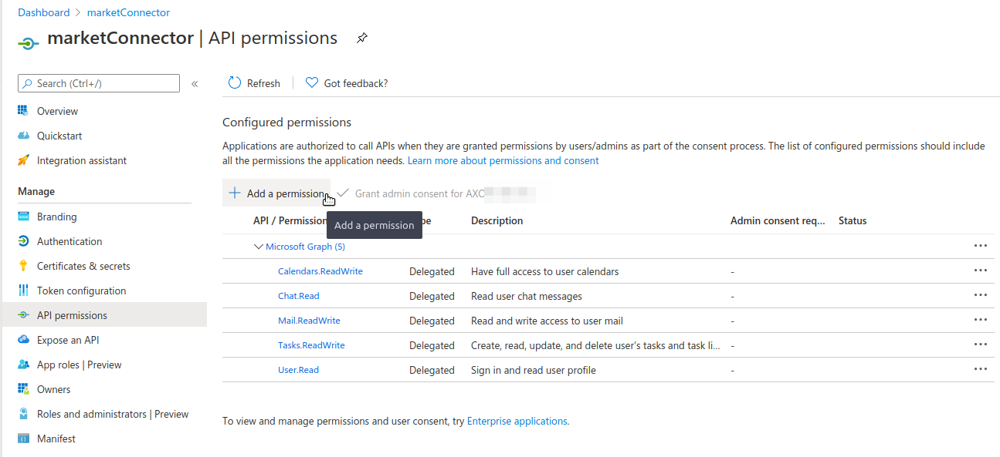

Microsoft Graph is the gateway to data and intelligence in Microsoft 365. It provides a unified programmability model that you can use to access the tremendous amount of data in Microsoft 365, Windows 10, and Enterprise Mobility + Security. Use the wealth of data in Microsoft Graph to build apps for organizations and consumers that interact with millions of users.

## Outlook Demo

Mail

Calendar

ToDo

## Setup

1. Register an application on Azure as desribed in the Microsoft's Java Tutorial https://docs.microsoft.com/en-us/graph/tutorials/java?tutorial-step=2
1. Navigate to `Overview` in the menu and copy the 'Application (client) ID' into Rest Client Definition property `AUTH.appId`.
1. Navigate to `Certificate & secrets` in the Azure App menu.
    1. Create a new secret by pressing `New client secret`. And select any validity period.
    
	1. copy the value of the generated secret into Rest Client Definition property `AUTH.secretKey`.
	
1. Navigate to `API Permissions` in the Azure App menu.
Add permissions via `Add a permission` > `Microsoft Graph` > `Delegated permissions`
The following permission must be granted:
	- User.Read
	- Calendars.ReadWrite
	- Mail.ReadWrite
	- Tasks.ReadWrite
    

1. Done. Start any process that connects with Microsoft 365.