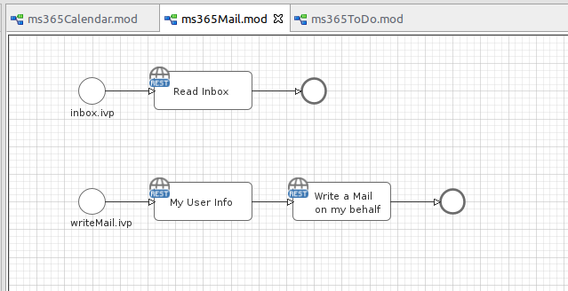

# Microsoft 365 Mail Connector
Axon Ivy’s [Microsoft Mail Calendar API](https://docs.microsoft.com/en-us/graph/outlook-mail-concept-overview)
connector helps you to accelerate process automation initiatives by integrating
Microsoft Outlook features into your process application within no time.
Automate message organization and processing. This connector:

- Is part of the Microsoft Graph REST API.
- Helps customers stay organized.
- Supports you with an easy-to-copy demo implementation to reduce your
  integration effort.
- Enables low code citizen developers to enhance existing business processes
  with Microsoft 365/Office features.

## Demo

## Setup

Follow the generic [Microsoft Graph setup](./msgraph) guide.
