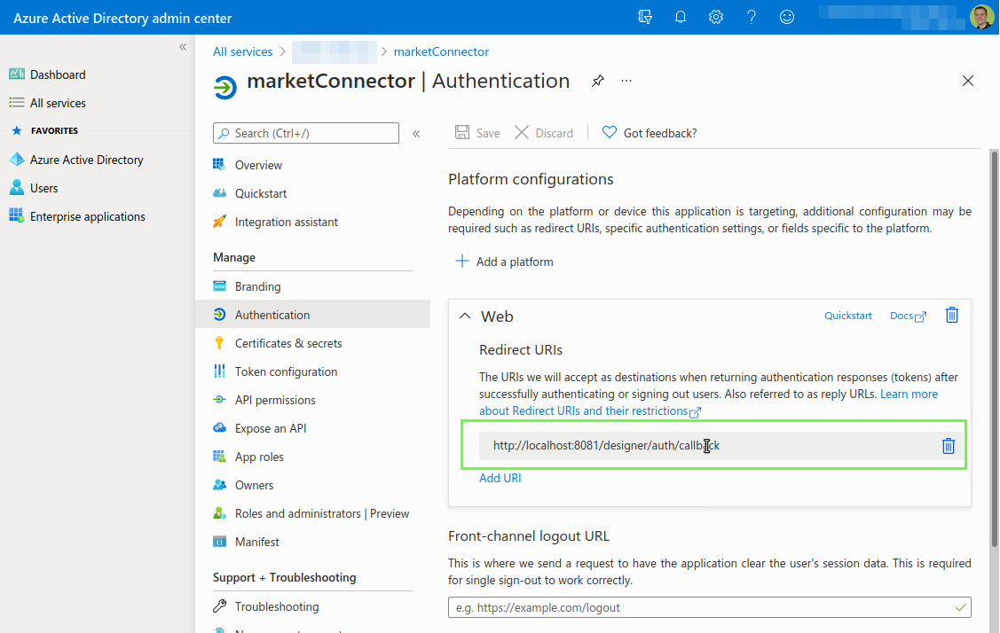
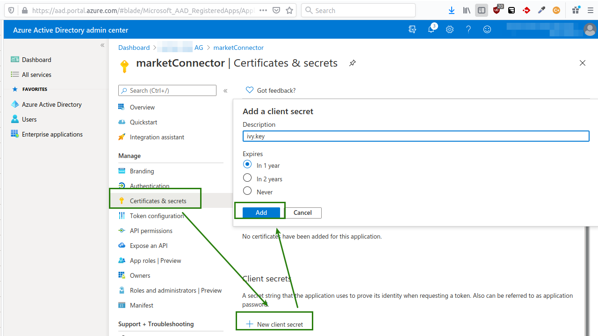
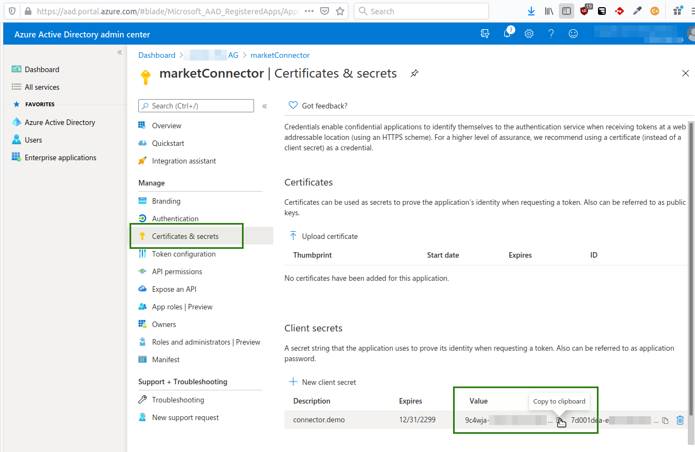
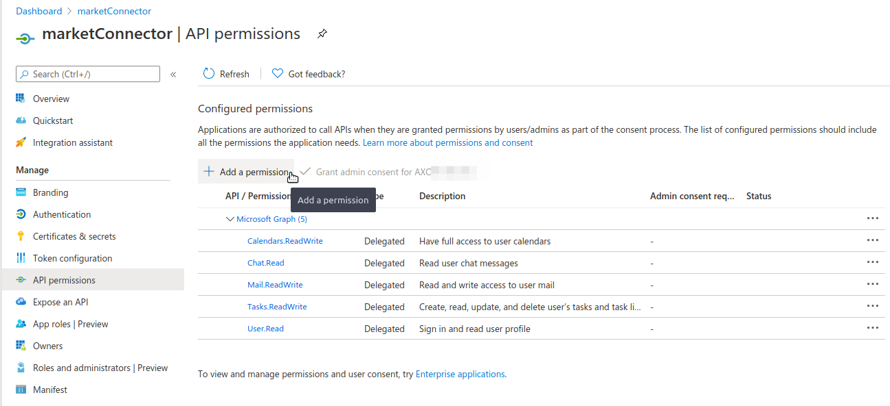

Axon Ivy’s [Microsoft 365](https://docs.microsoft.com/en-us/graph/overview) connector helps you to accelerate process automation initiatives by integrating Microsoft Outlook features into your process application within no time. The Microsoft Graph builds on Microsoft 365 APIs and allows developers to integrate their services with Microsoft products, including Windows, Microsoft 365, and Azure. This connector:

- Enables fast integration into any Microsoft 365 product easily.
- Offers a single endpoint to the Microsoft world
- Supports easy access to data from services like Excel, Microsoft Bookings, Microsoft Search, Microsoft Teams, OneDrive, OneNote, Outlook/Exchange, Planner, SharePoint, Workplace Analytics, Advanced Threat Analytics, Advanced Threat Protection, Azure Active Directory, Identity Manager, Intune, and much more

Microsoft Graph is the gateway to data and intelligence in Microsoft 365. It provides a unified programmability model that you can use to access the tremendous amount of data in Microsoft 365, Windows 10, and Enterprise Mobility + Security. Use the wealth of data in Microsoft Graph to build apps for organizations and consumers that interact with millions of users.

## Setup

1. Register an application on Azure as desribed in the Microsoft's Java Tutorial https://docs.microsoft.com/en-us/graph/tutorials/java?tutorial-step=2
1. Navigate to `Overview` in the menu and copy the 'Application (client) ID' into Rest Client Definition property `AUTH.appId`.
1. Navigate to `Authentication` in the Azure App menu.
	1. Add a `Redirect URI` in the `Web` Section.
		- Axon Ivy has an authentication callback URI which follows the pattern `{scheme}://{host}:{port}/{application}/auth/callback`. This URI must be registered in the Azure App.
		- Consequently, for the Axon Ivy Designer this URI can always be set to the following value: `http://localhost:8081/designer/auth/callback`
		- For the Axon Ivy Engine, the URI must contain the full URI where your application is reachable plus the callback path. E.g.: `https://my.workflows.ch/myApp/auth/calllback`
 

1. Navigate to `Certificate & secrets` in the Azure App menu.
    1. Create a new secret by pressing `New client secret`. And select any validity period.
    
	1. copy the value of the generated secret into Rest Client Definition property `AUTH.secretKey`.
	
1. Navigate to `API Permissions` in the Azure App menu.
Add permissions via `Add a permission` > `Microsoft Graph` > `Delegated permissions`
The following permission must be granted:
	- User.Read
	- Calendars.ReadWrite
	- Mail.ReadWrite
	- Tasks.ReadWrite
    

1. Done. Start any process that connects with Microsoft 365.
