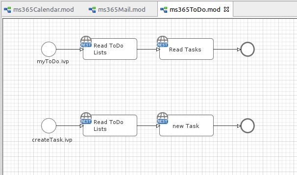

Axon Ivy’s [Microsoft Mail To Do API](https://docs.microsoft.com/en-us/graph/todo-concept-overview) connector helps you to accelerate process automation initiatives by integrating Microsoft Outlook features into your process application within no time. Microsoft To Do provides a simple way for people to manage their tasks and plan their day. This connector:

- Is part of the Microsoft Graph REST API.
- Enables task synchronization across any Microsoft 365 product easily.
- Supports you with an easy-to-copy demo implementation to reduce your integration effort.
- Enables low code citizen developers to enhance existing business processes with Microsoft 365/Office features.

## Microsoft ToDo Demo

## Setup

Follow the generic [Microsoft Graph setup](./msgraph) guide.
