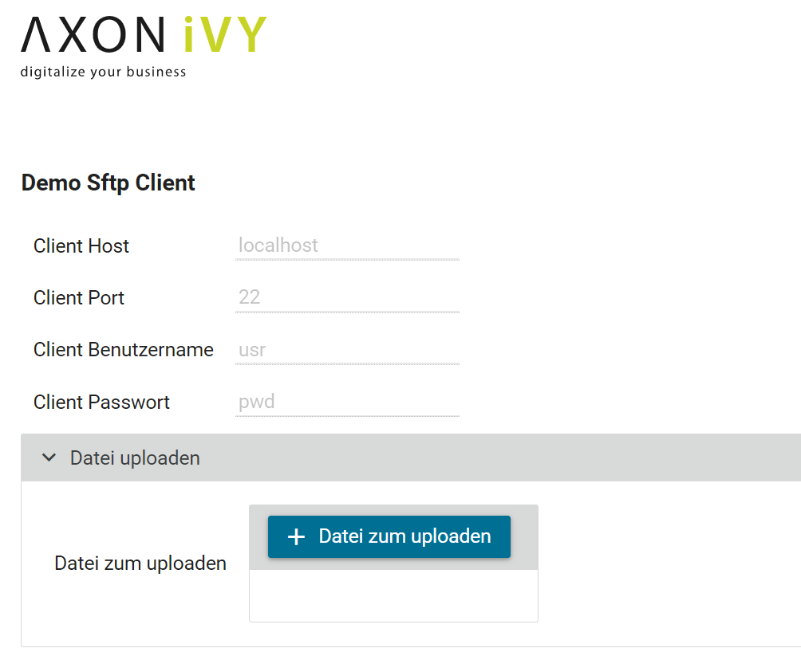
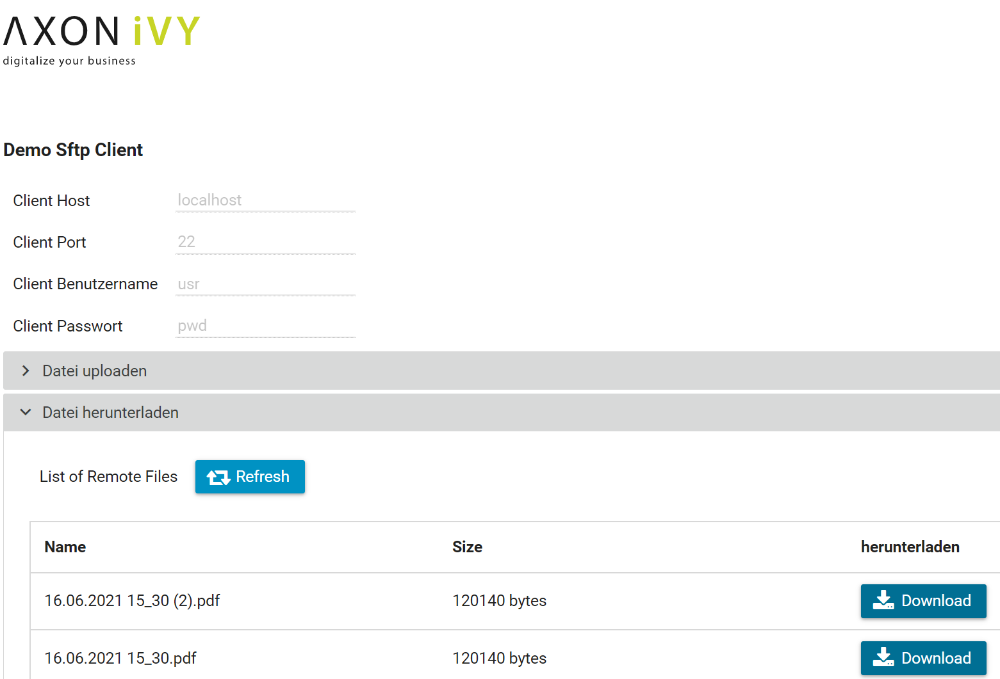
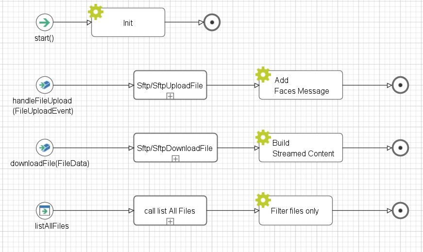

**SFTP Connector** is an SFTP client which uses the SFTP protocol to transfer files securely to and from a remote computer.
SFTP Connector is based on JSch [http://www.jcraft.com/jsch/] to handle the SFTP Connections and Operations.
JSch is a pure Java implementation of SSH2.
JSch allows you to connect to an sshd server and use port forwarding, X11 forwarding, file transfer, etc., and you can integrate its functionality into your own Java programs. JSch is licensed under BSD style license.


## Demo

1. Click on **Datei zum uploaden** and select one file from your local directory.

   

   Path: Sftp/SftpUploadFile -> uploadFile(fileToBeUploaded, filename)

   Description: this operation will upload the file to the root path on the server.

   Parameters: 

               - fileToBeUploaded -> the file to upload as java.io.InputStream

               - filename -> the file name as String


2. Click on **Refresh** to list all the files on the remote directory.

   - Select one file from the list and click on **Download**.

   

   Path: Sftp/SftpDownloadFile -> downloadFile(remoteFileName) Result: toFile

   Description: this operation will download the file from the server.

   Parameters: 

               - remoteFileName -> the file name as String

   Result: 

               - toFile -> the File to download as java.io.File

The **SftpClientDemo** HTML Dialog contains all the final operations to upload, list and download the file from/to the SFTP Server.

   

## Setup

Before starting the demo, please make sure to have an SSH/SFTP server on your computer (respective the computer you want to access). For testing, the following “Rebex Tiny SFTP Server (free)” was used.
Rebex Tiny SFTP Server (free): [https://www.rebex.net/tiny-sftp-server/]
Small, minimalist, single-user SFTP server for testing purposes, free for commercial and non-commercial use
1. Open the following settings in “RebexTinySftpServer.exe.config” with a text editor and update the following values:
   

2. Open the `Configuration/variables.yaml` in your Designer and update the following global variables:

   ```
   
   Variables:

     # The host name to the SFTP server.
     com_axonivy_connector_sftp_serverHost: 'localhost'

     # The password to the SFTP server.
     com_axonivy_connector_sftp_serverPassword: 'pwd'

     # The port number to the SFTP server.
     com_axonivy_connector_sftp_serverPort: 22

     # The user name to the SFTP server.
     com_axonivy_connector_sftp_serverUsername: 'usr'

   ```

4. Save the changed settings.


### Prerequisites:

* Working **SFTP Server**.
* You will also need the correct Server host name and the port number.
