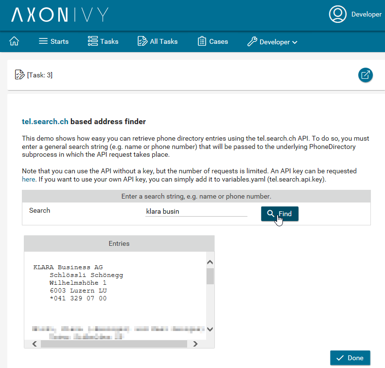

# tel.search.ch
Axon Ivy's **tel.search.ch** connector helps you to accelerate process automation initiatives by integrating the phone directory provided by tel.search.ch. This connector provides you a REST client that allows you to easily retrieve phone directory entries. Note that without an API key, the number of requests is limited. For more extensive use, you can request an API key [here](https://tel.search.ch/api/getkey). Fortunately, you can add your API key with a single click using the connector's authentication feature. This connector allows to:

- pass a search string and retrieve matching phone directory entries via the tel.search.ch API
- add your own API key
- supports you with an easy-to-copy demo implementation to reduce your integration effort

## Demo

