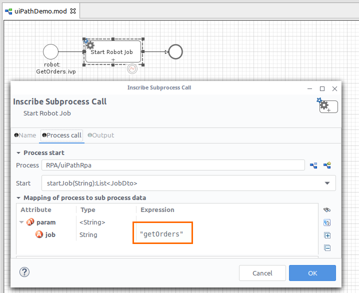
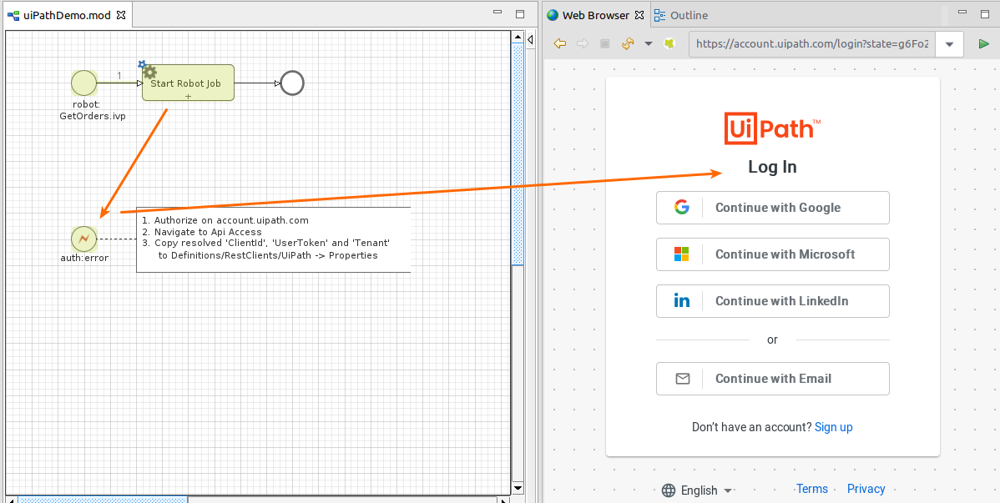
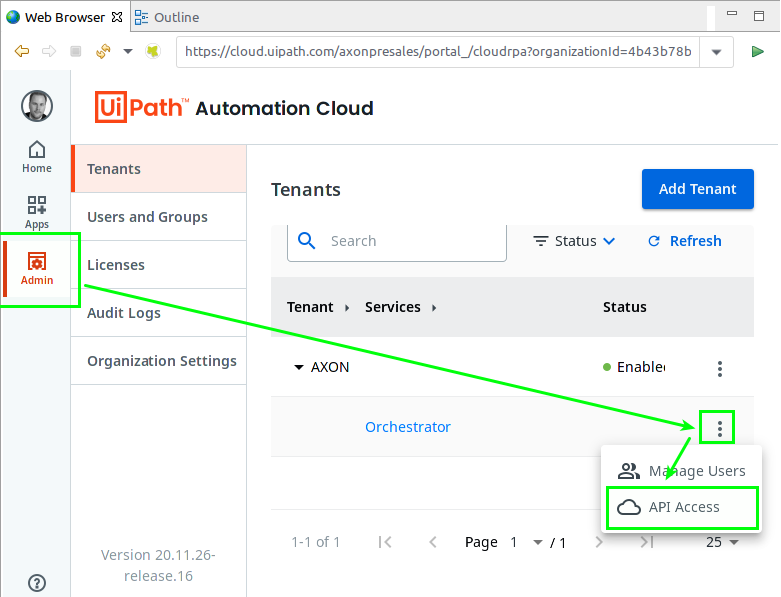
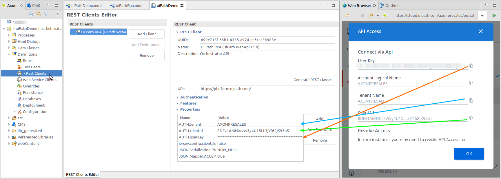
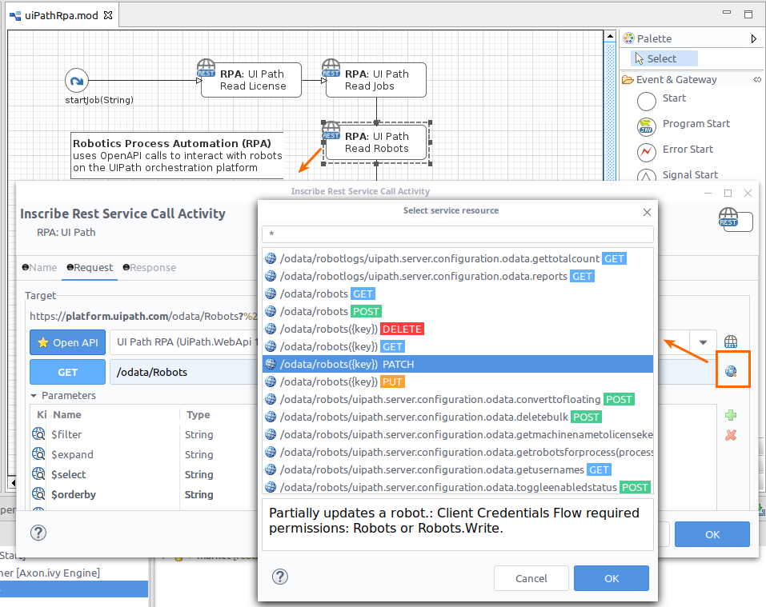

AXON Ivy’s UiPath connector helps you to accelerate process automation initiatives by setting up robots that replace manual work steps on legacy IT systems. Robotic Process Automation (RPA) works best when using a Digital Process Automation (DPA) platform to orchestrate end-to-end business processes

Now you can steer robotic work from your workflow process. This connector makes the UiPath RPA API features easy and attractive to use in business processes.

## Demo

With this connector a demo process will be installed to demonstrate prominent use cases for UiPath orchestrator interactions. E.g., 'startAJob' on an unattended robot.

 

## Authentication

Security matters! Data flows between the UiPath Orchestrator and the Axon.ivy Engine are encrypted and protected by OAUTH access tokens.

However, the systems must be introduced to each other. The Axon.ivy Engine needs a valid clientId and userKey that are allowed to connect to UiPath as substitute for your user account.

Proceed as follows:
1. Start any process that contains an UiPath activity interaction.
1. If OAUTH credentials are not present, the browser will redirect you to the UiPath cloud login page.
  
1. Login and navigate to: Admin > Tenant > Orchestrator > API Access
  
1. Copy the shown `clientId`, `userKey` and `tenant` to your Rest Client definition.
  
1. Start the process again. Now the AccessToken will be sent automatically within UiPath requests.

## Unlimited

Although the included demos focus on prominent use cases, be aware that our REST Client activities can use the full featured APIs that are provided by UiPath. In fact, it all can be done in low-code manner. Just select any service method to call and use the intuitive mapping tables to define your data flows.

Use the REST Client API browser to get a first outline on the UiPath orchestrator capabilities..
 

