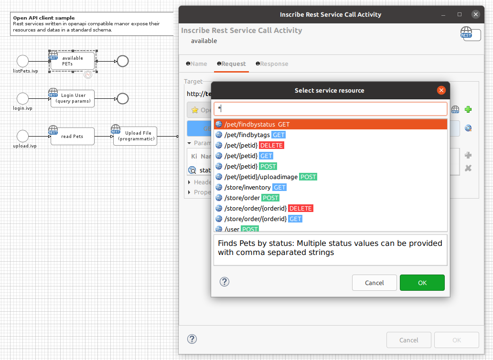
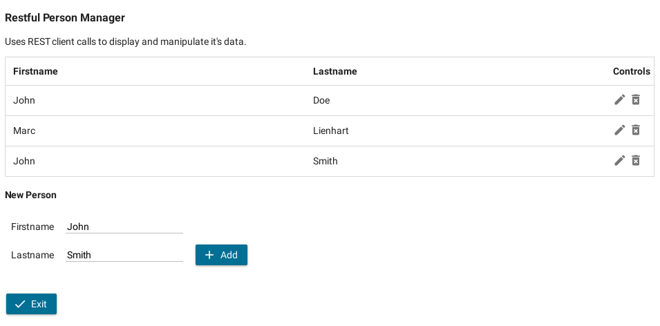

Axon Ivy's Connectivity (REST/SOAP) Demo nicely showcases how simple process
automation can be. Using standard architecture principles to create interactive
applications with web services is key to accelerate time-to-market. The
solution:
 
- illustrates how to access a own REST serivce
- includes an example of a business process being called via REST service
- points out async services using REST (own chat implementation)
- shows how easy data mapping works using REST
- exemplifies data upload via REST
- demonstrates REST in combination with OpenAPI and OData
- gives many examples of how to use SOAP service within the platform

### Demo

