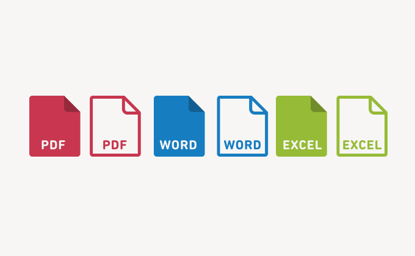
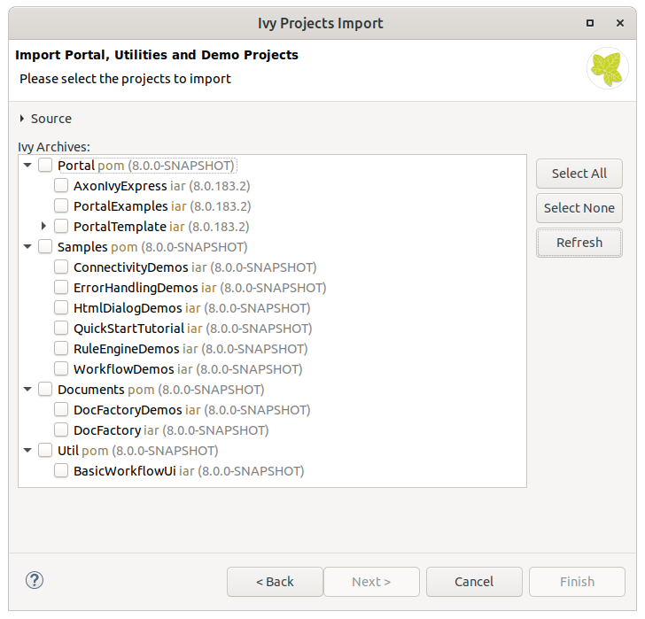

The Document Factory is a system that allows generating automatically documents like serial letters with the help of Microsoft Office Templates (.dot or .dotx files).
The Document Factory is open, can be extended and is based on the Java Library Aspose that is included in Axon.ivy platform.

### Import

You can use the import wizard in Axon.ivy Designer

`File > Import > Axon.ivy > Ivy Projects`

