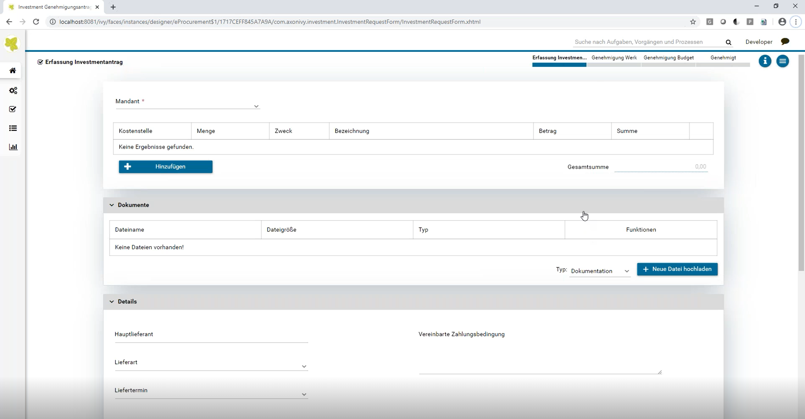
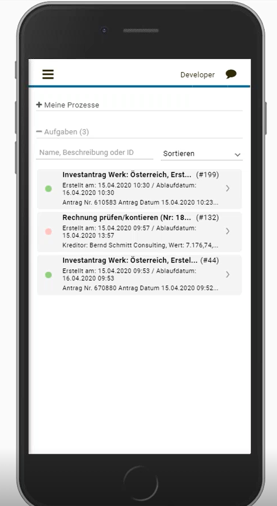

Axon Ivy’s E-procurement solution gives companies the best practice guidance to apply for investments and expenses. Depending on the amount of the investment/expense various approvers will be involved in the process. The requester can capture an array of information, such as delivery date & type, payment terms, year of activation, monthly liquidity effects. Moreover, the solution allows attaching documents (e.g. offers) to every request. The solution:

- will ensure high process compliance and best transparency by offering a structured request for investments & expenses
- supports a guided process according to policies and decision makers
- proves that a digital investments & expense request is much faster and user friendly
- guarantees easy approvals for managers
- makes sure that the right approvers are always involved based on the investment/expense amount

## Summary
This solution helps to orchestrate company’s investments and expenses. A multi-step approval workflow allows involving different approvers according to company's internal policies and procedures. Increased transparency and assured process compliance is the end result.

## Screenshots

## Information
-   Industry: All Industries
-   Compatible Version(s):  7.0.x, 8.0.x
