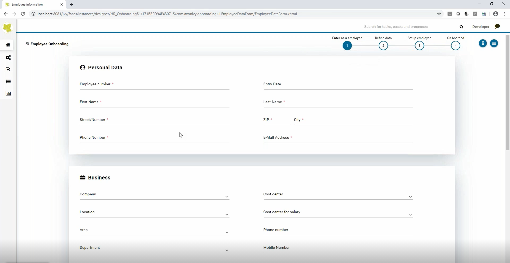

# Employee Onboarding solution
Axon Ivy’s Employee Onboarding solution provides best practice guidance to HR
specialists, ensuring that provisioning and all other aspects of the employee
onboarding process are handled quickly and efficiently. In addition, HR managers
and their superiors can capture all the information required to automatically
set up  employees in  HR systems. The solution:

- ensures timely and personalized communication with new employees from their
  first day on the job (and even before)
- guarantees no tasks are left undone
- helps new hires become productive much faster
- makes sure that required materials are procured and ready for employees in
  advance
- increases employee retention rates
- contributes to a positive company image

### Summary
You only have one chance to make a first impression. Failing to deliver a smooth
employee onboarding experience can contribute to high turnover rates and
inefficiency. A structured onboarding process ensures that employees have all
the necessary materials and information available when they start work, which
increases employee satisfaction. Axon Ivy’s Employee Onboarding Solution not
only coordinates processes within HR departments, it also automates functions
across external departments and process owners.

### Information
-   Industry: All Industries
-   Compatible Version(s):  7.0.x, 8.0.x

## Demo

