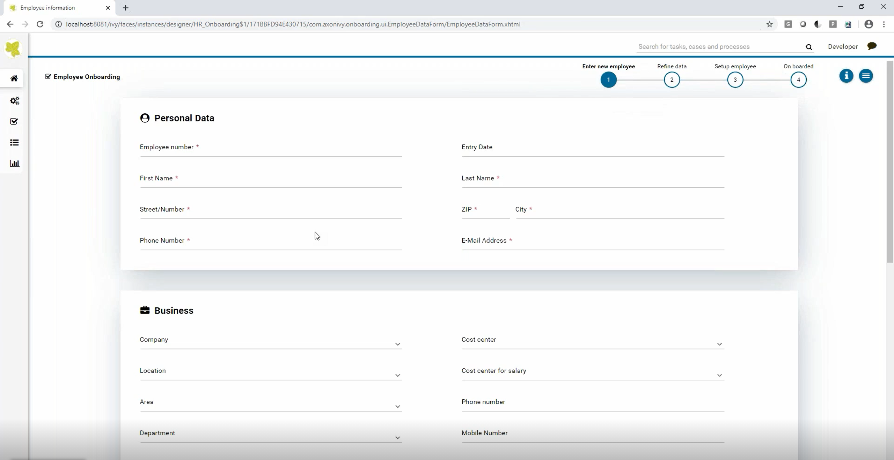
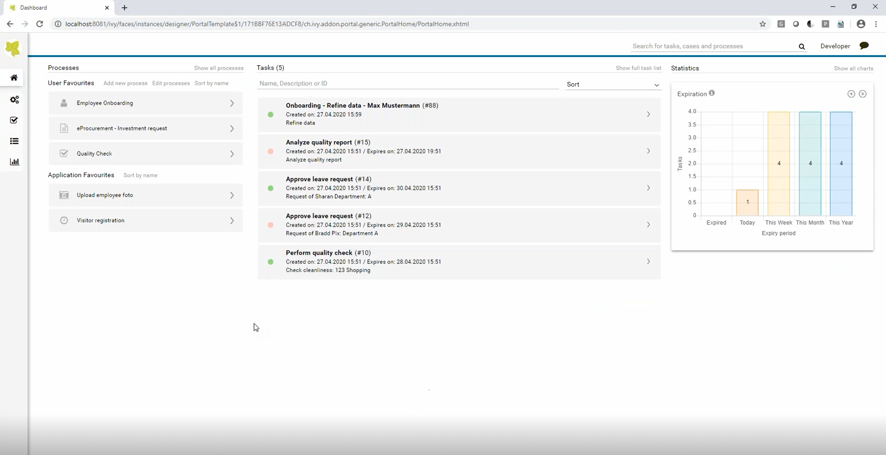

Axon Ivy’s Employee Onboarding solution gives HR the best practice guidance to coordinate responsibilities to ensure a smooth provision of work material and other arrangements. Moreover, HR manager and the superior can capture all relevant information which is necessary to automatically create the employee in the HR system. This solution:

- ensures a warm welcome to new employees from day one (and even the days before)
- guarantees no tasks left undone
- promises new hires become productive much faster
- makes sure that needed materials can be purchased in advance
- increases retention rates and finally
- contributes to a good reputation for the company’s image

## At a Glance
You only have one chance to make a first impression. Failing to bring everyone up to speed immediately can result in high turnover rates and poor efficiency. A structured onboarding process guarantees employees have all necessary materials and information from the first day on ensuring employee satisfaction. Onboarding is not just an HR concern, but requires the collaboration of several departments and process owners.

## YouTube Video

## Printscreens

## Information
-   Industry: All Industries
-   Compatible Version(s):  7.0.x, 8.0.x
