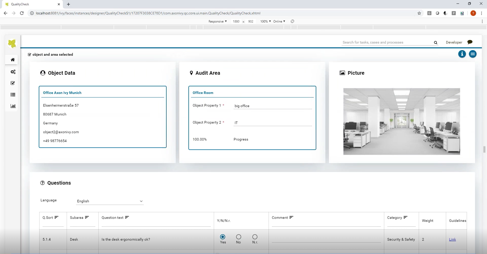

Axon Ivy’s Quality Check App is a solution for companies that have to execute regular quality check and controls on-site. The app supports quality check audits for various branches, objects, and areas. Based on a configurable question database, audits can be performed while even having your smart device in offline mode. The solution supports scoring functionality, allows the definition of measures as audit result, tracks any measure fullfillment and monitors every audit step in detail. Microsoft Excel export as well as automated PDF generation of audit reports are part of the standard implementation. The solution:

- supports hotels with regular room quality checks
- offers municipalities occasional checks of facilities like playgrounds and parks
- makes sure that facility managers receive monthly quality controls to check if any work was done properly
- guarantees service companies to regularly maintain objects like elevators and escalators
- ensures standard inspections of any machine of production companies
- improves not only work on-site but also back-office processes

## Summary
The Quality Check App improves on-site maintenance, inspection and service work. Think about companies like facility management, security services, cleaning services, hotels, or cities, and many more. Get rid of Microsoft Excel sheets and paper chaos. This solution increases efficiency, minimizes errors,and boosts customer satisfaction while reducing complexity for the business users in their daily tasks. Axon Ivy guarantees a great adaptability according to your individual needs.

## Screenshots

### Video

## Information
-   Industry: All Industries
-   Compatible Version(s):  7.0.x, 8.0.x
