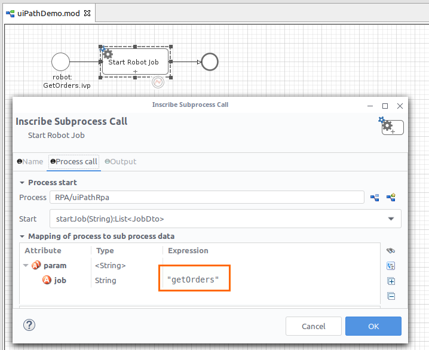
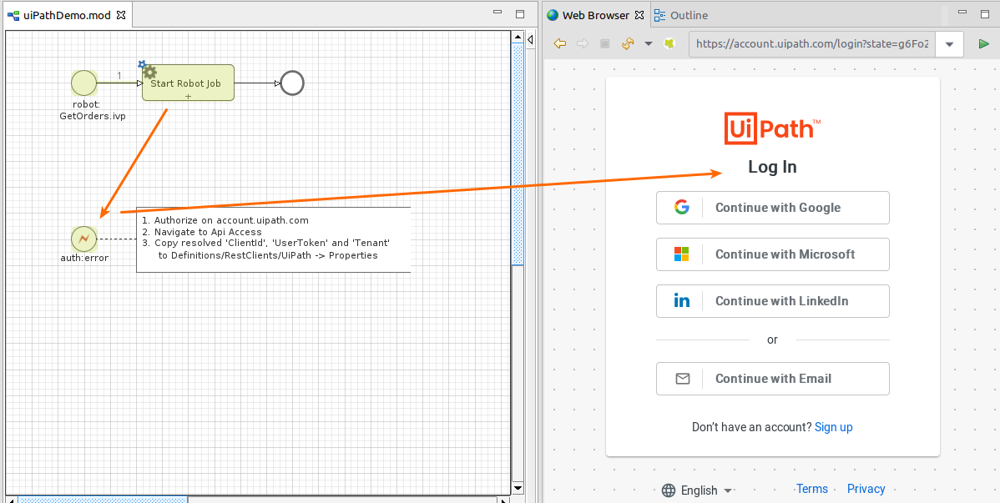
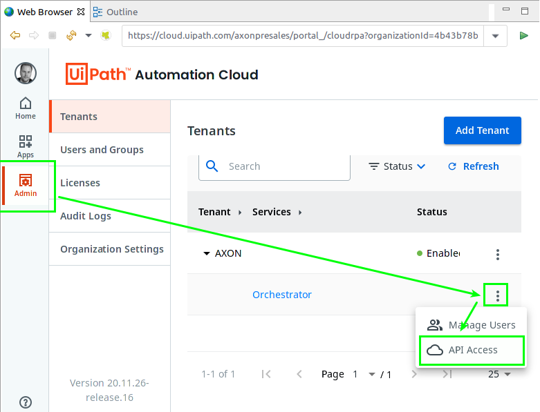
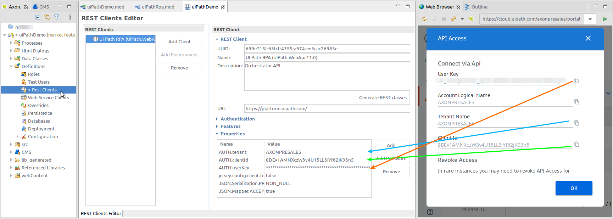
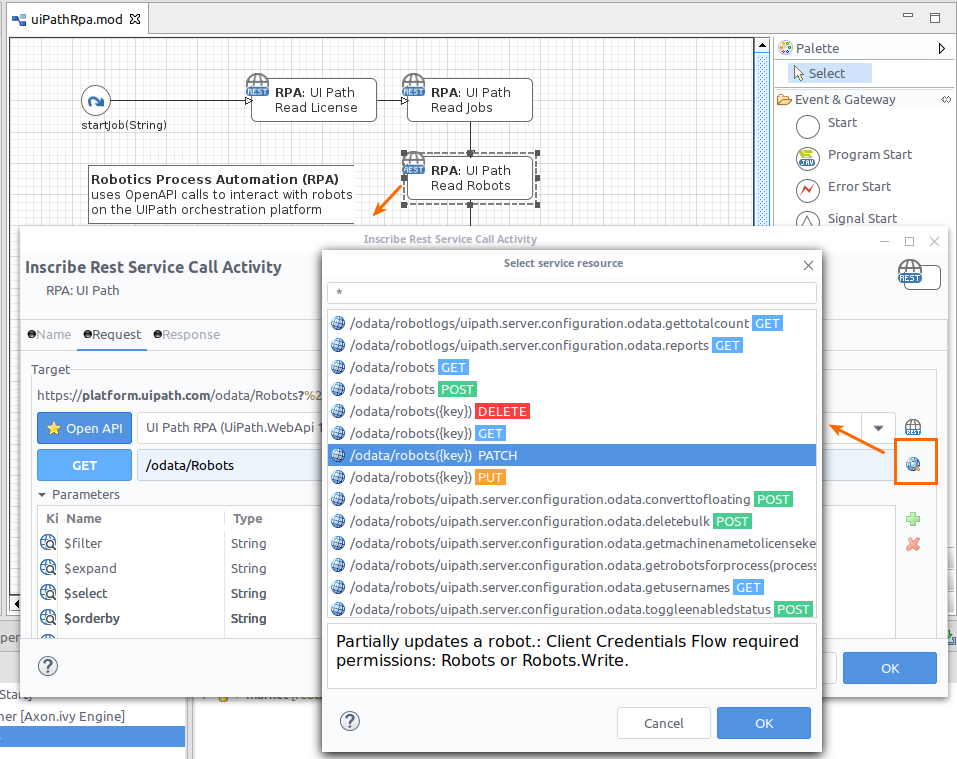

Robotic process automation will accelerate your digitalization journey.

With the UiPath Orchestrator it has become simple to setup robots that
replace manual work steps on legacy IT systems.

Now you can steer robotic work from your workflow process. This connector
makes the UiPath RPA API features easy and attractive to use in 
process Activities.

## Demo

With the connector a Demo process will be installed and show you prominent use-cases for UiPath orchestrator interactions. E.g. 'startAJob' on an unattended robot.

 

## Authentication

Security matters, data flows between the UiPath Orchestrator and the Axon.ivy Engine are encrypted and protected by OAUTH access tokens.

However, the systems must be introduced to each other. The Axon.ivy Engine needs a valid `clientId` and `userKey` that is allowed to connect to UiPath as substitute for your user account.

Proceed as follows:
1. Start any process that contains an UiPath activity interaction.
1. If OAUTH credentials are not present, the browser will redirect you to the UiPath cloud login page.
  
1. Login and navigate to: Admin > Tenant > Orchestrator > API Access
  
1. Copy the shown `clientId`, `userKey` and `tentant` to your Rest Client definition.
  
1. Start the process again. Now the AccessToken will be sent automatically within UiPath requests.

## Unlimited

Although the included Demos focus on prominent use-cases, be aware that our Rest Client Activities
 can use the full featured APIs that are provided by UiPath.
In fact, it all can be done in low-code manner. Just select service methods to call and use the
intuitive mapping tables to define your data flows.

Use the Rest Client API browser to get a first outline on the UiPath orchestrator capabilities.
 

