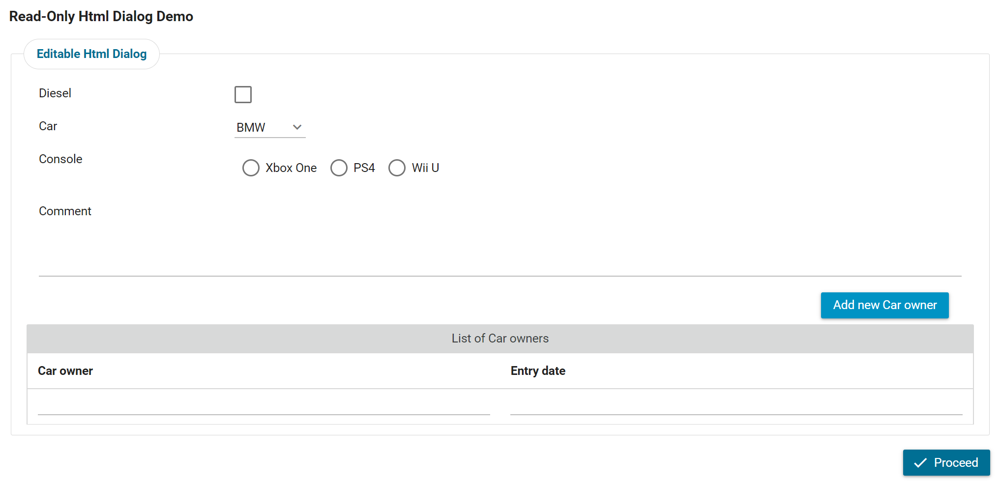
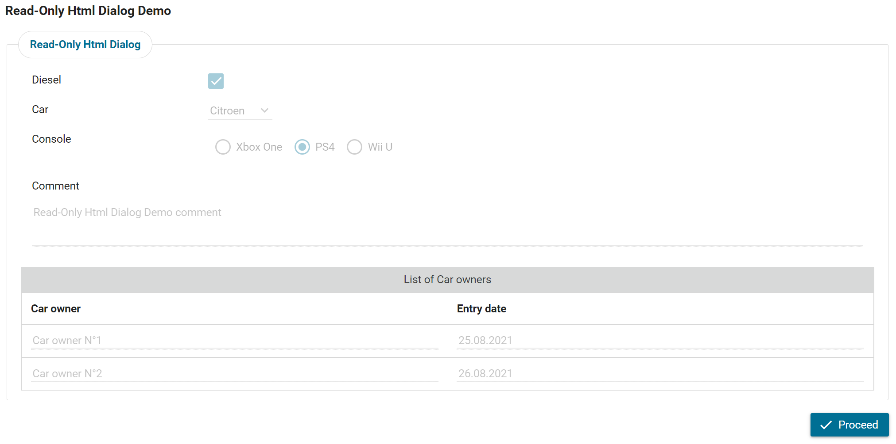

Axon Ivy's **Html Dialog Utils** is a collection of useful utilities to help you implement HTML Dialogs. The following utilities are available:

**ReadOnlyModeListener**

This JSF PhaseListener can be used in any HTML Dialog to make parts or the entire form not editable without adding extra controls to the JSF UI components.

Imagine an everyday use case such as an approval process. The first step will show an editable form to fill in all the required information. In the next step, the same form appears in read-only mode, so the user will verify the entered information and then decide whether to approve or decline the request.

The **ReadOnlyModeListener** will loop through all the included sub UI components within the main parent component and apply the following:
* all input components and links will be disabled
* all buttons won't be rendered
* all data tables won't be editable
* all components having the style class `doNotRenderInReadOnlyMode` won't be rendered
* all components having the style class `doNotDisable` won't be disabled

## Demo

1. Fill in the following editable Html-Dialog form

   

and click on "Proceed".


2. In the next step the same Html-Dialog will be rendered as Read-Only without adding any extra attributes to the JSF UI components.

   

## Setup

1. You can initialize the ReadOnlyModeListener at the user dialog start method like following:

   ```
   
        in.readOnlyListener = new ReadOnlyModeListener();
        in.readOnlyListener.enabled = true;
   
   ```

2. In the XHTML page, you should add the JSF phaseListener element like following:

   ```
   
        <f:phaseListener binding="#{data.readOnlyListener}" />
   
   ```
   
* By default, the ReadOnlyModeListener is disabled and the main parent component id is `form`.
* To activate it, you can set the parameter `isEnabled=true`.
* To specify the main parent component id, you can set the parameter ContainerId.
