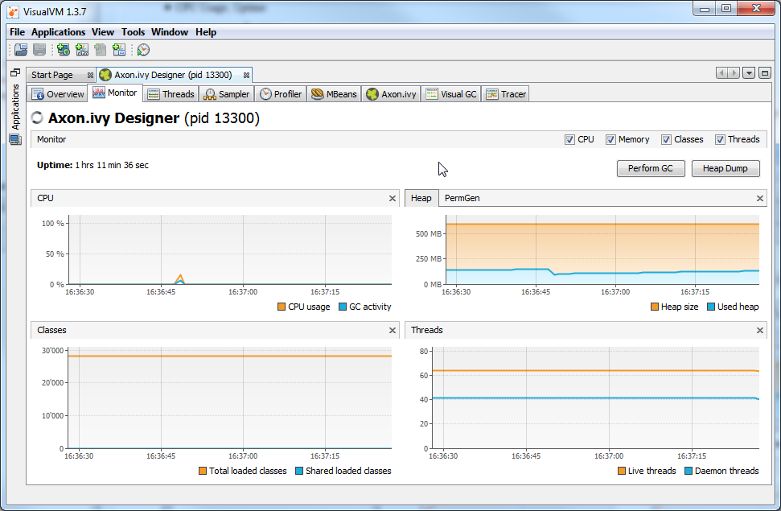

The Axon.ivy VisualVM plugin enables real-time monitoring of an Axon.ivy Engine for:

* HTTP requests
* System database connections and transactions
* REST Calls
* SOAP Web Service Requests
* Slow Queries to to External Databases
* License Information and Violations

and many more ...

### Installation

* [ Download and install VisualVM](https://visualvm.github.io/releases.html) (>1.3.7 and <2.0)
* Run VisualVM
* Go to the _Tools/Plugins_ menu
* Switch to _Downloaded_ tab and click on the _Add Plugins..._ button
* Select the downloaded `visualvm-plugin.nbm` in the file chooser
* Follow the instructions in the installation wizard
* Choose the option to restart VisualVM
